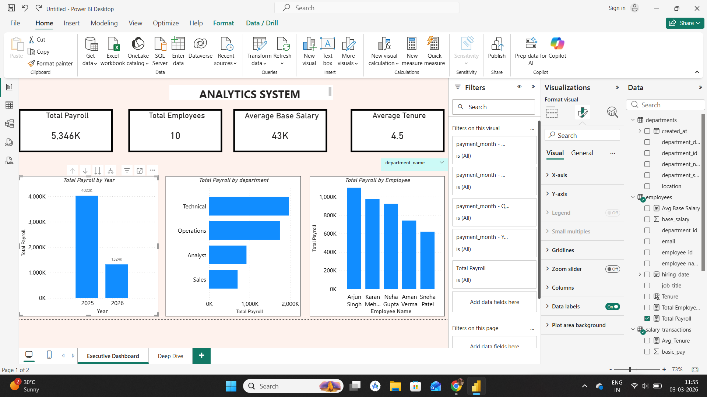
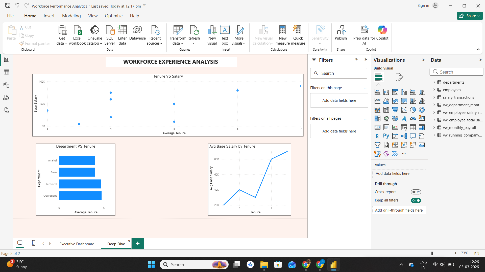

# Workforce & Payroll Analytics

HR and payroll analytics project built with **MySQL**, **SQL window functions** and a **Power BI** dashboard with **DAX** measures.

> Data is simulated (10 employees, monthly payroll) to demonstrate data modelling, SQL and BI skills. It is not real company data.

**Author:** Chaman Kumar Singh · [LinkedIn](https://www.linkedin.com/in/chaman-singh-5a67aa2b6)

## Database design (MySQL)

Normalised schema with primary/foreign keys and UNIQUE constraints (employee email, employee-month salary):

- `departments`
- `employees`
- `salary_transactions` (fact table: basic pay, bonus, deduction by month)

## SQL analytical views

| View | Purpose |
|---|---|
| `vw_monthly_payroll` | Total payroll per month |
| `vw_running_company_payroll` | Running (cumulative) payroll using `SUM() OVER (ORDER BY month)` |
| `vw_employee_total_salary` | Total earnings per employee |
| `vw_employee_salary_rank` | Employee ranking using `RANK() OVER (ORDER BY total_salary DESC)` |
| `vw_department_monthly_payroll` | Payroll by department and month |

Power BI reads from these views rather than raw tables.

## Power BI dashboard

**Executive Overview:** Total Payroll, Total Employees, Average Base Salary, Average Tenure, payroll by year, department and employee, department slicer.

**Workforce Experience Analysis:** salary vs tenure, average tenure by department.

## Tools

MySQL · SQL (GROUP BY, window functions, views) · Power BI · DAX

## How to run

1. Run `workforce_database.sql` in MySQL to create the schema, data and views.
2. Open `Workforce Performance Analytics.pbix` in Power BI Desktop and point it at your MySQL instance.
